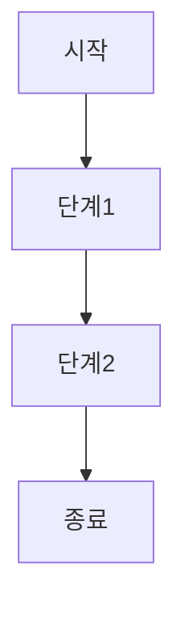

---
tags:
  - template
  - flow
---

# 플로우 문서 제목

> 간단한 설명

## 개요
- 프로세스의 목적과 범위

## 플로우 다이어그램

## 단계별 설명
### 1. 단계명
- 단계 설명
- 입력/출력

### 2. 단계명
- 단계 설명
- 입력/출력

## 예외 처리
- 예외 상황
- 에러 핸들링

## 참고 자료
- 관련 문서: [[다른 문서명]]
- 외부 링크: [링크 텍스트](URL)

## 태그
#flow

