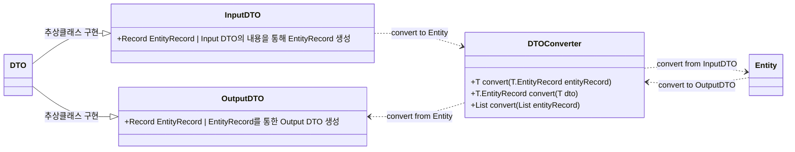

---
tags:
  - feature
  - backend
  - architecture
---

# DTO Converter 아키텍처

> DTO(Data Transfer Object)와 Entity 간의 데이터 변환 구조 및 흐름을 설명합니다.

## 개요

이 문서는 Jaree 서버의 DTO 변환 시스템을 정의합니다. DTO와 Entity 간의 의존성을 분리하고, 명확한 변환 인터페이스를 제공하는 것을 목적으로 합니다.

## 아키텍처 다이어그램

## 주요 구성 요소

### 1. DTO 계층 (DTO Hierarchy)

데이터 전송을 담당하는 객체들은 `DTO` 추상 클래스를 상속받아 구현됩니다.

- **InputDTO**: 클라이언트로부터 요청받은 데이터를 담습니다. 내부적으로 `EntityRecord`를 생성하여 Entity로의 변환을 지원합니다.
- **OutputDTO**: 클라이언트에게 응답할 데이터를 담습니다. Entity의 데이터를 기반으로 생성된 `EntityRecord`를 통해 만들어집니다.

### 2. DTOConverter

DTO와 Entity 사이의 변환 로직을 캡슐화한 인터페이스입니다.

- **역할**: 입력 데이터(InputDTO)를 엔티티 데이터로 변환하거나, 엔티티 데이터(EntityRecord)를 출력 데이터(OutputDTO)로 변환합니다.
- **주요 메서드**:
  - `convert(T dto)`: DTO 객체를 받아 EntityRecord로 변환합니다.
  - `convert(T.EntityRecord entityRecord)`: EntityRecord를 받아 DTO 객체로 변환합니다.
  - `convert(List<T.EntityRecord> entityRecord)`: 다수의 EntityRecord를 리스트 형태로 변환 처리합니다.

### 3. Entity & EntityRecord

- **Entity**: 실제 비즈니스 로직과 데이터베이스 매핑을 담당하는 도메인 객체입니다.
- **EntityRecord**: DTO와 Entity 사이에서 데이터를 전달하는 불변(Immutable) 데이터 위반(Record) 패턴을 사용할 수 있음을 시사합니다 (설계상 참조).

## 변환 흐름 (Conversion Flow)

1. **Input (요청)**: `InputDTO`가 `DTOConverter`에 전달되어 `Entity` 생성을 위한 데이터(`EntityRecord`)로 변환됩니다.
2. **Output (응답)**: `Entity`에서 추출된 데이터(`EntityRecord`)가 `DTOConverter`를 통해 `OutputDTO`로 변환되어 클라이언트에게 반환됩니다.
